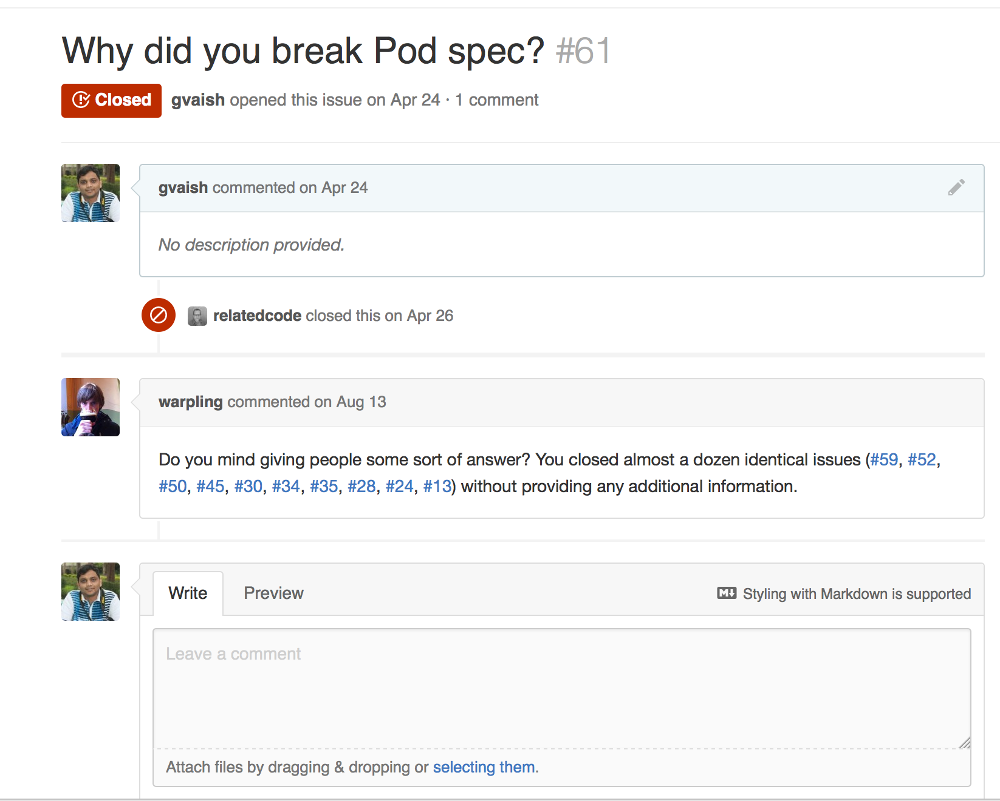

## Overview

ProgressHUD is a lightweight and easy-to-use HUD for iOS 7 (written in Objective-C).

This was original maintained by RC but then it was taken off the hook. Because it was under MIT license, I can copy and modify. :-)

#### Using

Use CocoaPods with the following definition:

```
pod 'ProgressHUD', :git => 'git@github.com:gvaish/ProgressHUD.git'
```

#### Displaying the HUD

```objective-c
+ (void)show:(NSString *)status;
+ (void)show:(NSString *)status Interaction:(BOOL)Interaction;

+ (void)showSuccess:(NSString *)status;
+ (void)showSuccess:(NSString *)status Interaction:(BOOL)Interaction;

+ (void)showError:(NSString *)status;
+ (void)showError:(NSString *)status Interaction:(BOOL)Interaction;
```

`showSuccess` and `showError` will automatically dismiss the HUD.

#### Dismissing the HUD

```objective-c
+ (void)dismiss;
```

#### Usage

1., Add the following import to the top of the file:

```objective-c
#import "ProgressHUD.h"
```

2., Use the following to display the HUD:

```objective-c
[ProgressHUD show:@"Please wait..."];
```

3., Simply dismiss after complete your task:

```objective-c
[ProgressHUD dismiss];
```

#### Color shemes

Use `sheme_white`, `sheme_black` or `sheme_color` depending on your needs. However feel free to customize the color settings in `ProgressHUD.h` file.

#### Credits

ProgressHUD was inspired by [SVProgressHUD](https://github.com/samvermette/SVProgressHUD) project.

The success and error icons are from [Glyphish](http://glyphish.com).

#### Contact

Use issues for feature updates or bugs or otherwise.

#### What happened earlier




